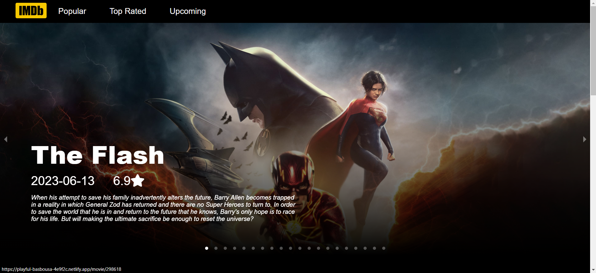
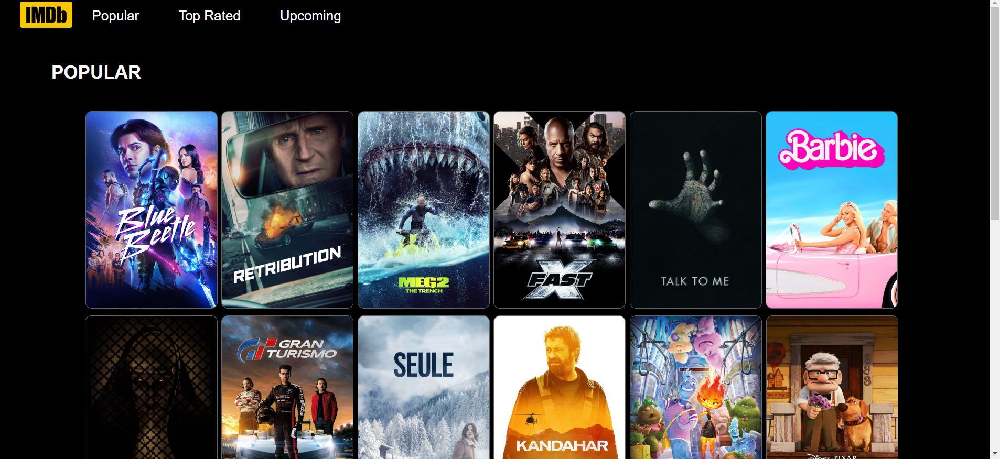

# IMDb Clone Project

This is an IMDb clone project built using React. It allows users to browse popular movies, view movie details, and explore different movie categories.

## Table of Contents

- [Demo](#demo)
- [Features](#features)
- [Installation](#installation)
- [API](#api)
- [Contributing](#contributing)

## Demo

You can check out a live demo of the project [here](https://playful-basbousa-4e9f2c.netlify.app/).

## ScreenShots


*Home Page*


*Popular movies page*

## Features

- Browse popular movies.
- View detailed information about a specific movie.
- Explore movies in different categories (i.e., popular, top-rated, upcoming).
- Links to the movie's homepage and IMDb page.
- Responsive design for mobile and desktop.
- 
## API

This project uses the [TMDB API](https://www.themoviedb.org/documentation/api) to fetch movie data. You'll need to sign up for a TMDB API key and replace the placeholder API key in the code with your own.
** Put your API Key in the home.js, movie.js and movieList.js **

## Installation

1. Clone the repository:

   ```bash
    git clone https://github.com/Raunik2/IMDB_Clone_Webstie.git

2. Navigate to the project directory:
   
   ```bash
   cd IMDB_Clone_Webstie

4. Install dependencies:
   
   ```bash
   npm install

6. Start the application:
   
   ```bash
   npm start
   
7. Open your web browser and navigate to the following URL:
   
   ```bash
   http://localhost:3000

## Contributing

Contributions are welcome! If you'd like to contribute to this project, please follow these steps:

1. Fork the repository.
2. Create a new branch for your feature or bug fix.
3. Make your changes and commit them with descriptive messages.
4. Push your changes to your fork.
5. Create a pull request to the main repository.

Please make sure to follow the project's coding style.


